<div align="center">

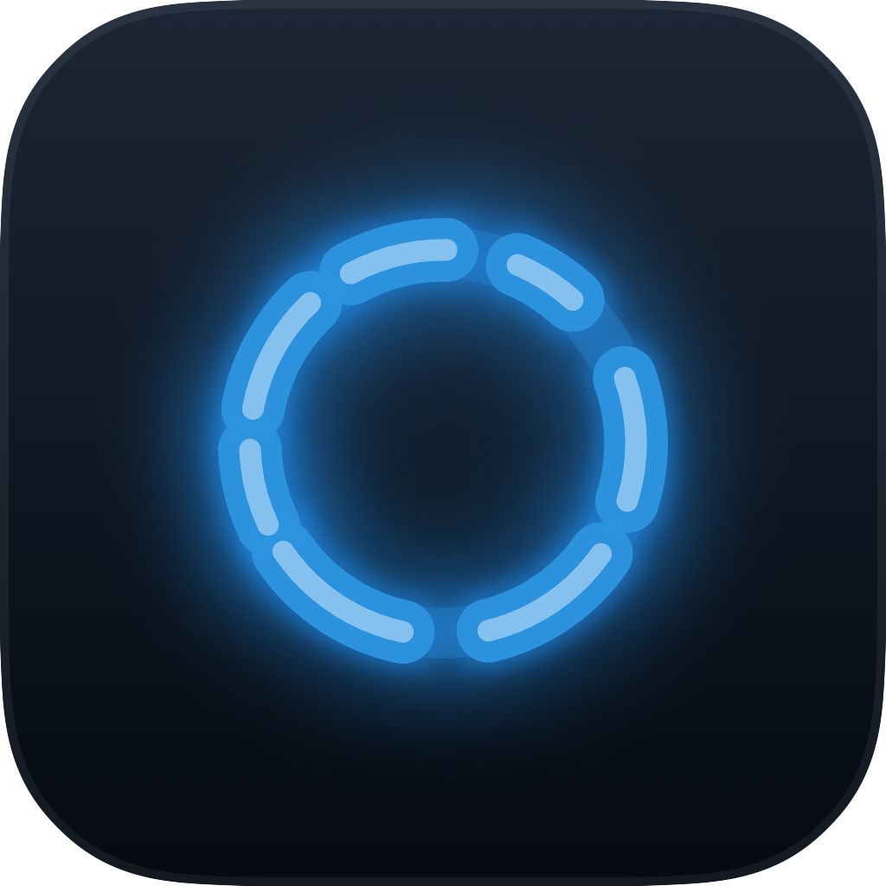

# Detroit Ring

**A status ring for [Claude Code](https://github.com/anthropics/claude-code), styled after the android LED from _Detroit: Become Human_.**

It puts a small glowing ring on your desktop, one per Claude Code session. Blue while it's
working, amber when it's waiting on you, green when it's finished. Glance over, know where things
stand, get back to whatever you were doing.

Native macOS app. No Electron, no menu-bar icon, no browser tab.


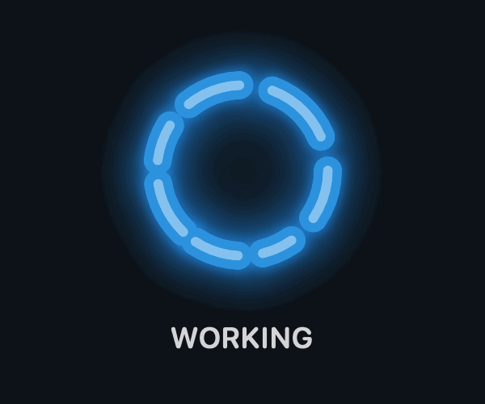

</div>

---

## What it's for

You kick off a long task in Claude Code and switch to something else. The annoying part is not
knowing what happened while you were away: still grinding, blocked on a prompt, or done ages ago?

Detroit Ring sits in the corner of your screen and answers that without you opening the terminal.
The color and motion are the status, copied from the temple LED the androids wear in the game:

- 🔵 blue, spinning — working
- 🟡 amber — waiting for you
- 🟢 green, pulsing — just finished

When real work wraps up it also fires a quiet macOS notification, so you'll know even if you're in
another app. The ring holds green for a few minutes and then settles into a dim standby glow.

## Features

- Five states (working / waiting / done / error / idle), each its own color and motion.
- One ring per live session. Three sessions running means three rings stacked in the capsule,
  each tracking its own.
- Drag the capsule wherever you want. It defaults to the top-right, remembers where you put it,
  and stays clamped on-screen.
- A done notification fires only after real work finishes (at least 15s of actual work, waiting
  time excluded), so short prompts don't spam you.
- Runs as an `LSUIElement` agent: no Dock icon, no menu-bar item, no window chrome. The capsule
  hides itself when no session is live; an open-but-idle session keeps a dim ring.
- The ring is drawn analytically with no random jitter, so it's deterministic and stays crisp at
  any size.
- Eleven hidden _Detroit_ easter eggs that drift across the ring now and then while it works (see
  below). Off with a right-click if you'd rather not.
- Driven entirely by Claude Code's hooks. No API polling, no network, no API keys; the app just
  watches a small folder of state files the hooks write.
- Reversible: three install scripts, three matching uninstall steps, nothing it can't undo.

## The five states

<table>
<tr>
<td align="center">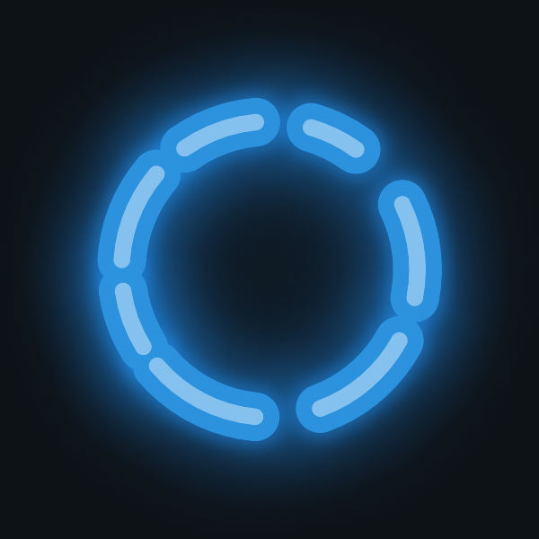<br/><b>Working</b><br/><sub>blue, rotating segments</sub></td>
<td align="center">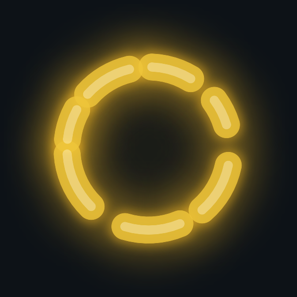<br/><b>Waiting for you</b><br/><sub>amber sweep</sub></td>
<td align="center">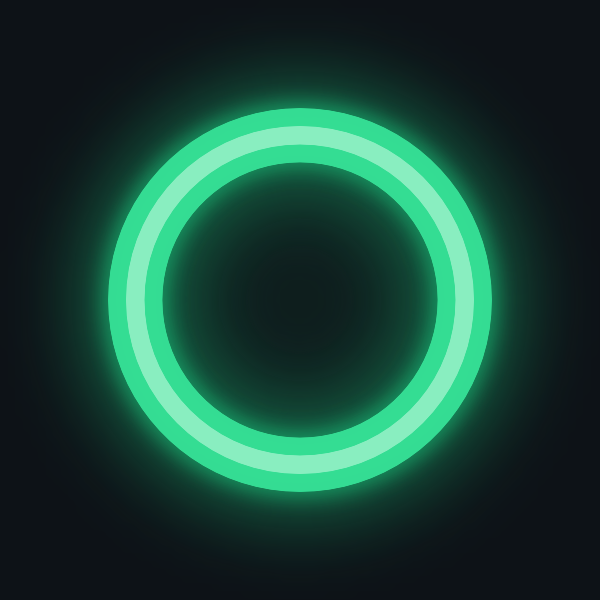<br/><b>Done</b><br/><sub>green pulse, then standby</sub></td>
<td align="center">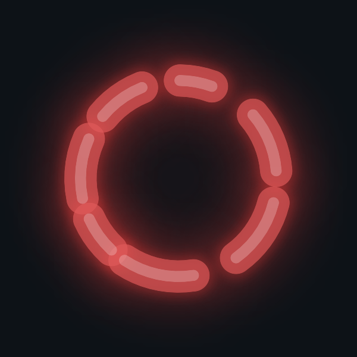<br/><b>Error</b><br/><sub>red, softened</sub></td>
<td align="center"><br/><b>Idle</b><br/><sub>dim standby</sub></td>
</tr>
</table>

> The capsule with a few live rings:
>
> 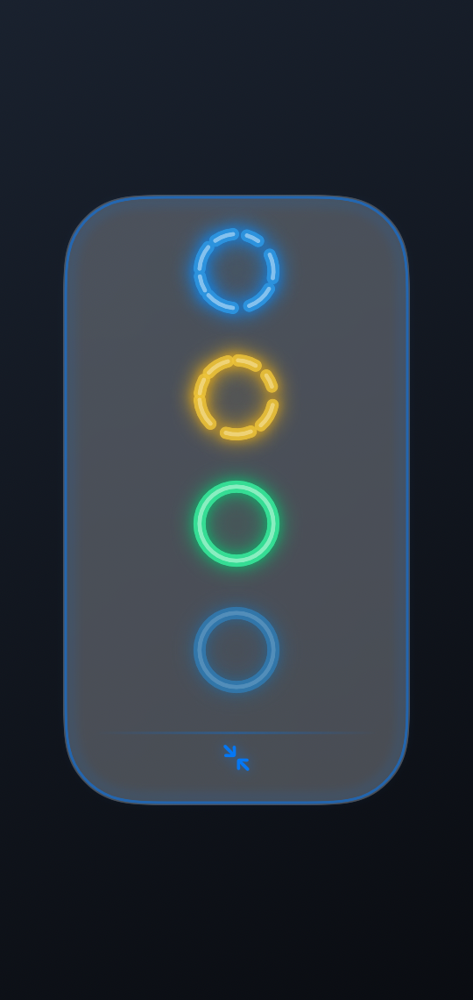

## Easter eggs

Once in a while, an ambient _Detroit: Become Human_ moment plays over a working ring: a deviant
glitch, a flash of **rA9**, Connor's coin flip, Markus's paint sweep, Kara's guardian light, a
salvo when everything finishes, some Detroit snow. They're occasional, never override a real
status, and you can turn them off from the right-click menu.

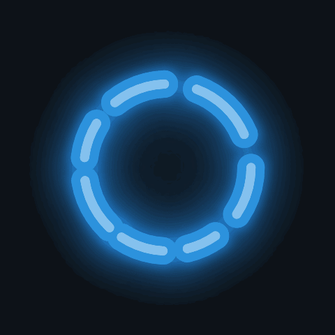

<table>
<tr>
<td align="center">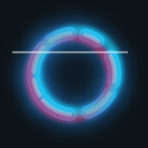<br/><sub>Deviant glitch</sub></td>
<td align="center"><br/><sub>rA9</sub></td>
<td align="center">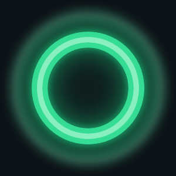<br/><sub>Done salvo</sub></td>
<td align="center">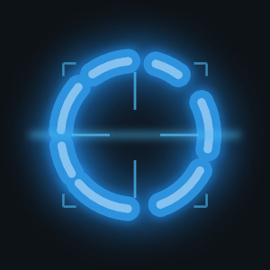<br/><sub>Preconstruction scan</sub></td>
</tr>
<tr>
<td align="center">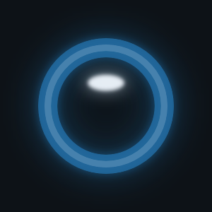<br/><sub>Coin flip</sub></td>
<td align="center">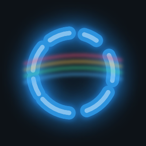<br/><sub>Paint sweep</sub></td>
<td align="center">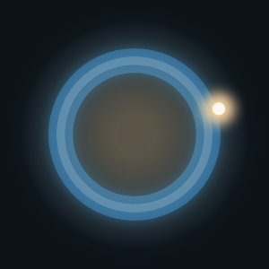<br/><sub>Companion light</sub></td>
<td align="center">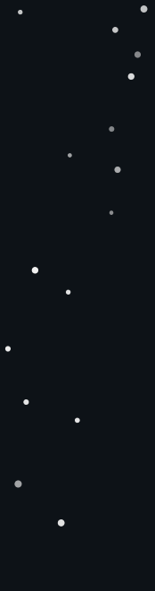<br/><sub>Detroit snow</sub></td>
</tr>
</table>

<sub>Right-click the ring to toggle the easter eggs or preview one.</sub>

## Install

You'll need macOS 13+ on Apple Silicon, [Claude Code](https://github.com/anthropics/claude-code),
and the Swift toolchain (run `xcode-select --install` if you don't have it). Python 3 already
ships with macOS.

```bash
git clone https://github.com/lhysilicon/detroit-ring.git
cd detroit-ring

# 1. compile, self-test, bundle, and install the .app into ~/Applications
#    (this also drops the hook emitter into ~/.claude/ring/)
./build.sh

# 2. wire the ring into your Claude Code hooks
#    run it once without --apply first to preview the change; your settings.json isn't touched
python3 apply_hooks.py            # writes settings.staging.json so you can diff it
python3 apply_hooks.py --apply    # applies it, backing up the original first

# 3. start it at login and keep it running
./install_launchagent.sh
```

Open a new Claude Code session and the ring shows up.

It's an ad-hoc signed local build, so the first launch may need a right-click → **Open**, or
**System Settings → Privacy & Security → Open Anyway**.

### What each script touches

| Script | What it does | Touches |
|---|---|---|
| `build.sh` | Compiles the app, runs the self-test, builds and signs the `.app`, copies the hook emitter | `~/Applications`, `~/.claude/ring/` |
| `apply_hooks.py` | Appends the ring hooks to your `settings.json`. Existing hooks are kept, it's idempotent, and it backs up first | `~/.claude/settings.json` |
| `install_launchagent.sh` | Generates and loads a LaunchAgent so the app starts at login | `~/Library/LaunchAgents/` |

## How it works

```
Claude Code hooks ──▶ ring-emit ──▶ ~/.claude/ring/sessions/<id>.json ──▶ DetroitRing.app ──▶ 🟢
   (lifecycle)        (tiny py)        (one file per live session)         (SwiftUI ring)
```

Every Claude Code lifecycle event (`SessionStart`, `UserPromptSubmit`, `PreToolUse`, `Stop`,
`Notification`, `SessionEnd`, `PostToolUseFailure`) runs `ring-emit`, a small Python script that
writes a JSON state file for the session and exits. It prints nothing and never blocks the agent.

`DetroitRing.app` watches that folder, keeps one ring per live session, and draws the capsule. The
ring is a pure function of `(state, time)` with no randomness, so an off-screen render comes out
byte-for-byte identical to the live one, which is how the visuals get unit-tested.

Headless `claude -p` calls (pipelines, automation) are detected and skipped, so only the
interactive sessions you're actually watching get a ring.

It's about 2k lines of Swift plus the Python emitter, system frameworks only, no third-party
dependencies and nothing talking to the network.

## Configuration

Right-click the ring:

- **Hide all terminal windows** / **Show all terminal windows**
- **Easter eggs** — turn the ambient effects on or off
- **Preview an easter egg** — fire one right now
- **Reset position** — move the capsule back to the top-right
- **Quit**

Left-click a ring to raise its terminal window.

## Uninstall

```bash
./install_launchagent.sh uninstall            # stop and remove the LaunchAgent
rm -rf ~/Applications/DetroitRing.app          # remove the app
rm -rf ~/.claude/ring                          # remove the emitter and state files
cp settings.json.pre-ring-bak ~/.claude/settings.json   # restore your original hooks
```

`settings.json.pre-ring-bak` is the backup `apply_hooks.py --apply` saved before it touched
anything. If you'd rather not do a full restore, just delete the `ring-emit` lines it added.

## Development

```bash
swiftc -O src/Ring.swift src/AppCore.swift src/main.swift -o /tmp/dr && /tmp/dr --selftest
```

The self-test covers the state-machine reducer, the display logic, session eviction, and a
determinism check (same time in, identical pixels out). `tools/inspect.swift` renders every state
and easter egg to PNGs for eyeballing, and `tools/test_emit.py` covers the emitter's logic.

## Disclaimer

Unofficial fan project. _Detroit: Become Human_ is a trademark of Quantic Dream; this isn't
affiliated with, endorsed by, or sponsored by Quantic Dream or Sony Interactive Entertainment. The
ring is an original recreation inspired by the game's LED and ships none of the game's assets.
Claude Code is a product of Anthropic, and this is a community tool, not affiliated with them
either.

## License

[MIT](LICENSE).
